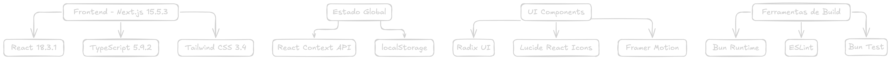
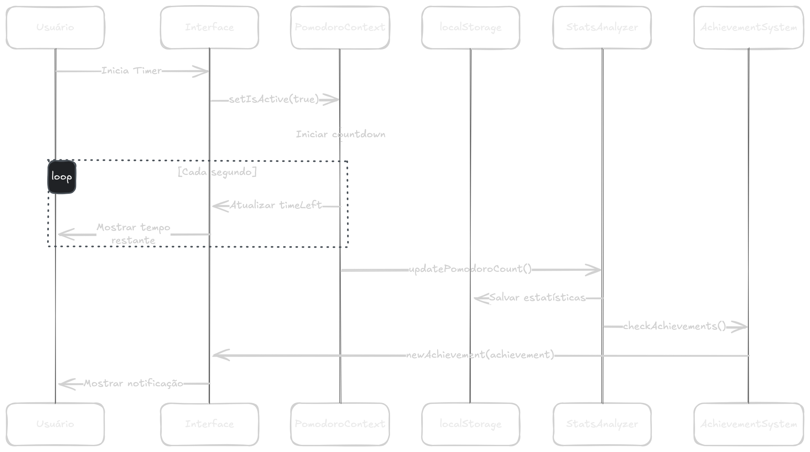
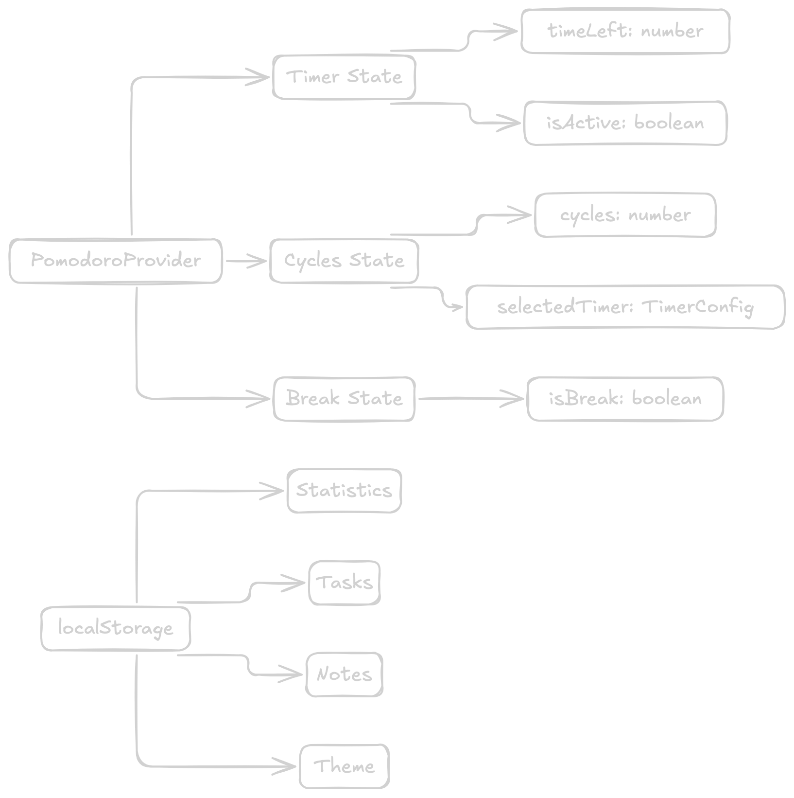
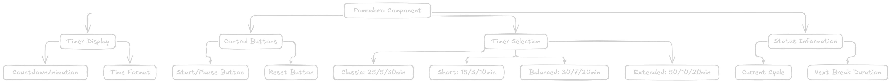
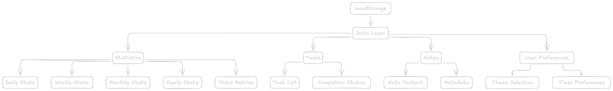
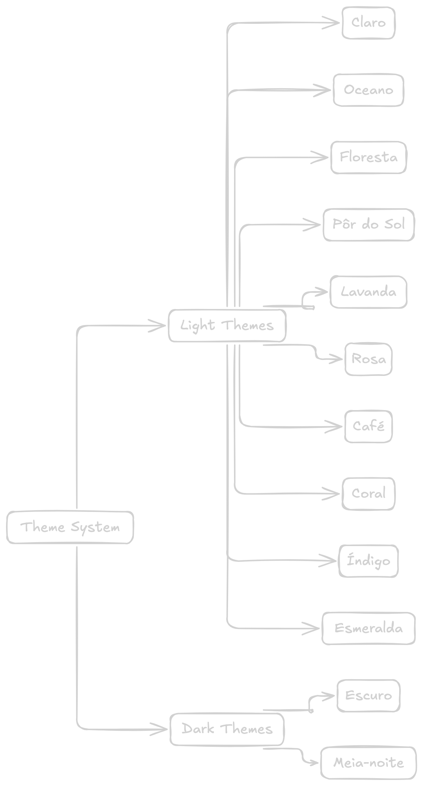
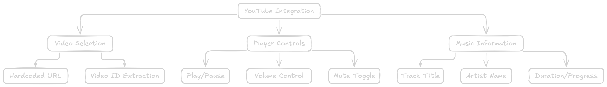

# Estudo de Caso: PomoCute - Aplicação Web de Produtividade

## Resumo Executivo

PomoCute é uma aplicação web moderna desenvolvida para aumentar a produtividade através da implementação da Técnica Pomodoro. A aplicação combina um timer personalizável com funcionalidades auxiliares como gerenciamento de tarefas, sistema de notas rápidas, estatísticas detalhadas e integração com música de foco.

## 1. Visão Geral do Projeto

### 1.1 Objetivo
Criar uma ferramenta de produtividade intuitiva e visualmente atrativa que implemente a Técnica Pomodoro, oferecendo funcionalidades complementares para organização pessoal e acompanhamento de progresso.

### 1.2 Técnica Pomodoro
A Técnica Pomodoro é um método de gerenciamento de tempo que utiliza intervalos de trabalho focado (tradicionalmente 25 minutos) separados por pausas curtas (5 minutos), com pausas mais longas após completar um ciclo de sessões.

### 1.3 Características Principais
- Timer Pomodoro com múltiplos presets
- Sistema de gerenciamento de tarefas
- Notas rápidas com suporte a Markdown
- Estatísticas e analytics de produtividade
- Sistema de conquistas (gamificação)
- Integração com YouTube para música de foco
- Interface responsiva e acessível
- Múltiplos temas visuais

## 2. Arquitetura Técnica

### 2.1 Stack Tecnológico



### 2.2 Estrutura de Diretórios

```
src/
├── app/                    # Next.js App Router
│   ├── layout.tsx         # Layout global + configurações
│   ├── page.tsx           # Página principal
│   └── globals.css        # Estilos globais + temas
├── components/            # Componentes React
│   ├── ui/               # Componentes shadcn/ui
│   ├── pomodoro.tsx      # Timer principal
│   ├── PomodoroProvider.tsx # Context do timer
│   ├── tasks.tsx         # Gerenciamento de tarefas
│   ├── quick-notes.tsx   # Sistema de notas
│   ├── stats.tsx         # Estatísticas
│   ├── theme-selector.tsx # Seletor de temas
│   └── [outros]
├── functions/            # Lógica de negócio
│   ├── statsHandle.ts    # Manipulação de estatísticas
│   ├── achievementsHandle.ts # Sistema de conquistas
│   └── sounds.ts         # Efeitos sonoros
├── types/               # Definições TypeScript
│   └── types.ts         # Interfaces principais
├── fonts/               # Fontes customizadas
├── hooks/               # Custom hooks
└── styles/              # Estilos adicionais
```

## 3. Arquitetura do Sistema

### 3.1 Fluxo de Dados Principal



### 3.2 Gerenciamento de Estado



## 4. Componentes Principais

### 4.1 Sistema de Timer



### 4.2 Sistema de Persistência



## 5. Funcionalidades Detalhadas

### 5.1 Timer Pomodoro

**Presets Disponíveis:**
- **Clássico:** 25min foco / 5min pausa / 30min pausa longa (4 ciclos)
- **Curto:** 15min foco / 3min pausa / 10min pausa longa (5 ciclos)
- **Balanceado:** 30min foco / 7min pausa / 20min pausa longa (4 ciclos)
- **Extendido:** 50min foco / 10min pausa / 20min pausa longa (3 ciclos)

**Funcionalidades:**
- Controles de play/pause/reset
- Indicador visual de progresso
- Notificações sonoras
- Transição automática entre modos
- Acompanhamento de ciclos

### 5.2 Sistema de Tarefas

```typescript
interface Tasks {
    task: string;
    completed: boolean;
}
```

**Funcionalidades:**
- Adicionar/remover tarefas
- Marcar como concluída
- Persistência automática
- Contagem de tarefas completadas
- Interface responsiva

### 5.3 Sistema de Notas Rápidas

```typescript
interface Notes {
    id: string;      // nanoid
    title: string;
    description: string;
    content: string; // Suporte Markdown
}
```

**Funcionalidades:**
- Criação/edição/exclusão de notas
- Suporte completo a Markdown
- Modos de visualização/edição
- Busca e organização
- Nota de boas-vindas padrão

### 5.4 Sistema de Estatísticas

```typescript
interface Statistics {
    daily: PomodoroData[];
    weekly: PomodoroData[];
    monthly: MonthlyPomodoroData[];
    yearly: PomodoroData[];
    totalPomodoro: number;
    totalTime: number;
    consecutiveDays: number;
    completedTasksCount: number;
    quickNotes: number;
    musicListeningDuration: number;
}
```

**Métricas Acompanhadas:**
- Pomodoros completados por período
- Tempo total de foco
- Dias consecutivos de uso
- Tarefas completadas
- Notas criadas
- Tempo de música

### 5.5 Sistema de Conquistas

**Critérios de Conquistas:**
- Marcos de pomodoros completados
- Dias consecutivos de uso
- Quantidade de tarefas completadas
- Tempo total de foco
- Criação de notas

**Funcionalidades:**
- Verificação automática após ações
- Notificações visuais
- Sistema de progressão
- Gamificação da produtividade

## 6. Interface e Design

### 6.1 Sistema de Temas

A aplicação oferece 12 temas distintos:



### 6.2 Responsividade

**Breakpoints:**
- Mobile: < 640px
- Tablet: 640px - 768px
- Desktop: > 768px

**Adaptações Mobile:**
- Layout vertical em coluna única
- Menu hambúrguer para navegação
- Componentes otimizados para toque
- Tipografia escalável
- Safe areas para iOS

### 6.3 Acessibilidade

**Implementações:**
- Navegação por teclado
- Screen reader support
- Aria labels e roles
- Contrastes adequados
- Skip links
- Anúncios de estado do timer

## 7. Integração com YouTube

### 7.1 Player de Música



**Funcionalidades:**
- Player embutido invisível
- Controles customizados
- Informações da música
- Barra de progresso
- Controle de volume

## 8. Performance e Otimização

### 8.1 Métricas de Performance

**Otimizações Implementadas:**
- Lazy loading de componentes
- Code splitting automático do Next.js
- Fonts com display: swap
- Minimização de re-renders
- localStorage para persistência

**Pontos de Melhoria Identificados:**
- Timer logic com re-renders excessivos
- localStorage writes sem debounce
- Possíveis memory leaks no timer interval
- Bundle size analysis necessária

### 8.2 Gerenciamento de Estado

**Context API Usage:**
- PomodoroProvider para estado do timer
- Estados locais para componentes isolados
- localStorage para persistência
- Evita prop drilling

## 9. Testes e Qualidade

### 9.1 Estrutura de Testes

```
src/__tests__/
├── PomodoroProvider.test.tsx  # Configurações de timer
├── stats.test.ts              # Testes de estatísticas
└── utils.test.ts              # Funções utilitárias
```

**Arquivos de Configuração:**
- `bunfig.toml` - Configuração do Bun Test
- `test-setup.ts` - Setup global e mocks
- `tsconfig.test.json` - TypeScript para testes
- `TESTING.md` - Documentação detalhada

**Configuração:**
- Bun Test como test runner nativo
- Happy-dom para ambiente de testes (opcional)
- TypeScript support nativo
- Coverage reports integrados
- Mocks simplificados para localStorage, DOM APIs

### 9.2 Migração de Testes

**Migração Jest → Bun Test:**
- **Performance**: 7x mais rápido (~42ms vs ~300ms)
- **Dependências**: Removidas 15+ bibliotecas
- **Configuração**: Simplificada drasticamente
- **TypeScript**: Suporte nativo sem transpilação

**Status Atual:**
- ✅ 14 testes passando
- ✅ 77 assertions executadas
- ✅ ~42ms de execução
- ✅ Zero dependências externas

### 9.3 Qualidade de Código

**Ferramentas:**
- ESLint para linting
- TypeScript para type safety
- Bun Test para testes unitários
- Next.js built-in optimizations

## 10. Deployment e DevOps

### 10.1 Build Process

**Scripts Disponíveis:**
```json
{
  "dev": "next dev",
  "build": "next build",
  "start": "next start",
  "lint": "next lint",
  "test": "bun test",
  "test:watch": "bun test --watch",
  "test:coverage": "bun test --coverage"
}
```

### 10.2 Runtime Environment

**Bun Runtime:**
- Gerenciador de pacotes
- Runtime JavaScript
- Performance melhorada
- Compatibilidade com npm

## 11. Problemas Conhecidos e Limitações

### 11.1 Issues Técnicos

1. **Timer Performance:**
   - Re-renders excessivos no useEffect
   - Possíveis memory leaks no interval

2. **Persistência:**
   - localStorage writes frequentes
   - Ausência de validação de schema
   - Sem sistema de backup/sync

3. **UI/UX:**
   - Loading states ausentes
   - Error boundaries limitados
   - Acessibilidade incompleta

### 11.2 Código Legacy

1. **Código Comentado:**
   - Blocos grandes em page.tsx
   - URLs hardcoded
   - Funções não utilizadas

2. **Type Safety:**
   - localStorage sem validação
   - Any types em algumas integrações

## 12. Roadmap e Melhorias Futuras

### 12.1 Funcionalidades Planejadas

**Curto Prazo:**
- PWA support completo
- Notificações push
- Sync multi-dispositivo
- Temas customizáveis

**Médio Prazo:**
- Analytics avançados
- Integração com calendários
- Backup na nuvem
- Relatórios de produtividade

**Longo Prazo:**
- IA para sugestões de produtividade
- Integração com outras apps
- Colaboração em equipe
- API pública

### 12.2 Melhorias Técnicas

**Performance:**
- Otimização do timer logic
- Debounce para localStorage
- Bundle size optimization
- Memory leak fixes

**Qualidade:**
- Cobertura de testes aumentada (meta: 80%+)
- Testes de componentes React com Bun Test
- Error handling robusto
- Accessibility compliance
- Documentation completa

## 13. Conclusões

### 13.1 Impacto e Valor

PomoCute demonstra uma implementação efetiva de uma aplicação web moderna, combinando design atrativo com funcionalidades práticas. A arquitetura escolhida permite escalabilidade futura e manutenção eficiente, enquanto oferece uma experiência de usuário envolvente para melhoria de produtividade.